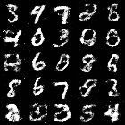
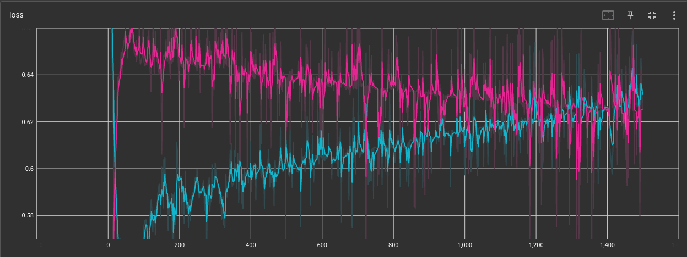

# GAN---Pytorch

The code was created on the article https://arxiv.org/pdf/1406.2661

### Results:
#### Generated image

#### Loss

#### Weight:
https://drive.google.com/drive/folders/1KgNQ_jQVY3FSzDEHpCB9sH4ZEkTuBkGF?usp=sharing

## Library

* Pytorch - https://github.com/pytorch

